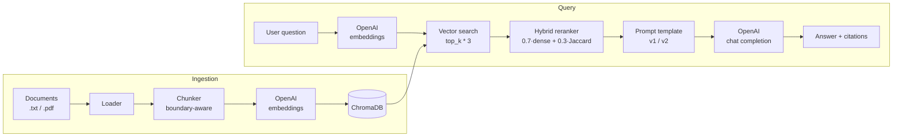

# rag-production-template

[](https://github.com/martinbacaia/rag-production-template/actions/workflows/ci.yml)
[](https://www.python.org/downloads/)
[](LICENSE)
[](http://mypy-lang.org/)
[](https://docs.astral.sh/ruff/)

A Retrieval-Augmented Generation system written from scratch — no LangChain, no LlamaIndex — to expose every component (chunking, embedding, vector search, hybrid reranking, prompt templating, generation, evaluation) as a small, replaceable, well-tested unit. FastAPI for HTTP, ChromaDB for vector storage, OpenAI for embeddings and chat completion, structured logging, multi-stage Docker, and a deterministic evaluation harness with a 20-question golden dataset.

---

## Architecture



The same `Embedder` and `VectorStore` instances are shared across the ingestion and query paths, wired through FastAPI's dependency injection so tests can swap the OpenAI client and Chroma backend with fakes.

---

## Why this exists

A demonstration that the boilerplate-free path is also the production path. Concretely:

- **What it shows.** End-to-end system design: typed config, abstract interfaces with multiple implementations (`Protocol` for narrow contracts, `ABC` for full backends), structured logging, retry policies that distinguish transient from caller errors, prompt versioning as code, deterministic chunk IDs for idempotent re-ingest, hybrid retrieval, integration tests that exercise the full wiring without touching the network.
- **What it is NOT.** A finished SaaS. There is no auth, no per-tenant isolation, no rate limiting, no multi-document summarization, no long-context optimization, no adaptive chunking, no support for multimodal documents. The vector store is single-node. The reranker is a simple Jaccard blend, not a cross-encoder. See [Production considerations](#production-considerations) for what changes for real scale.
- **Why no LangChain.** Frameworks like LangChain hide the parts that matter most when you debug a misbehaving system: the exact prompt sent, the retrieval scores, the retry policy, the chunking math. Implementing the components directly forces those decisions into the open and into version control.

---

## Quick start

```bash
# 1. Install
python -m venv .venv && source .venv/bin/activate    # Windows: .venv\Scripts\activate
pip install -r requirements-dev.txt && pip install -e .

# 2. Configure
cp .env.example .env
# edit .env and set OPENAI_API_KEY=sk-...

# 3. Run the API
uvicorn rag.api.main:app --reload
# → open http://127.0.0.1:8000/docs for the OpenAPI UI
```

To ingest a document and ask a question:

```bash
curl -X POST http://127.0.0.1:8000/ingest \
  -H "Content-Type: application/json" \
  -d '{"text": "Decorators wrap functions in Python.", "source": "demo.txt"}'

curl -X POST http://127.0.0.1:8000/query \
  -H "Content-Type: application/json" \
  -d '{"question": "What do decorators do?"}'
```

To run the bundled evaluation:

```bash
python -m rag.eval
```

Or with Docker:

```bash
export OPENAI_API_KEY=sk-...
docker compose up --build
```

---

## Architecture decisions

The non-obvious choices, with the reasoning a code reviewer can challenge.

### Chunking — boundary-aware, character-based

A sliding window over characters (default 800 chars, 120 overlap) snaps the cut to the nearest sentence boundary within a 15 % tolerance window. Token-aware chunking is more "correct" for embedding model context limits, but token counts drift between SDK versions; characters are deterministic. For `text-embedding-3-small` (8 191-token context), 800 chars (~200 tokens) is comfortably under the limit. See `rag/ingestion/chunker.py`.

### Retrieval — hybrid dense + lexical

Dense embeddings excel at semantic similarity but miss exact-term matches (numbers, identifiers, code snippets). The reranker blends `0.7 × cosine_similarity + 0.3 × Jaccard(query_tokens, doc_tokens)`. Why Jaccard and not BM25? BM25 needs corpus-wide statistics and a tokenizer; Jaccard is ~30 lines and gets ~80 % of the value. The `KeywordOverlapReranker` slot is interface-compatible with a future cross-encoder. See `rag/retrieval/reranker.py`.

### Vector store — Chroma with an abstraction

ChromaDB runs embedded (single-process) or as an HTTP service (the docker-compose layout). Both modes flow through the same `VectorStore` ABC, so swapping to Qdrant, Pinecone, or pgvector is one new class. Cosine distance is converted to a `[0, 1]` similarity inside the Chroma adapter so callers never see backend-specific scoring. See `rag/vectorstore/`.

### Prompt templates — versioned, registered, treated as code

Two templates ship: `v1` (minimal, single instruction + context + question) and `v2` (system role with explicit anti-hallucination rules and a fixed refusal string). New versions are added to the registry, never edited in place, so an eval regression can be reproduced by pinning the older version. See `rag/generation/prompt_templates.py`.

### Retry policy — surgical, not greedy

`tenacity` with exponential backoff (1 s → 8 s, max 4 attempts) retries only `RateLimitError`, `APITimeoutError`, `APIConnectionError`, and 5xx. 4xx errors fail loud — retrying a 400 four times wastes money and masks the caller bug. See `rag/generation/llm_client.py`.

### Tests — fakes over mocks, integration over isolation

Unit tests use lightweight fakes (`FakeEmbedder`, `FakeStore`) that implement the contract, not `MagicMock` objects that accept any call. Integration tests build the real FastAPI app, override OpenAI and the vector store with fakes via `app.dependency_overrides`, and exercise routing, validation, dependency injection, the ingestion pipeline, the reranker, and prompt rendering — everything except the network. The full suite (135 tests) runs in under 7 seconds.

---

## Evaluation results

Real numbers from running `python -m rag.eval` against the bundled 20-question golden dataset (Python stdlib documentation excerpts: `itertools`, `functools`, `dataclasses`).

**Run config**: `gpt-4o-mini`, `text-embedding-3-small`, prompt template `v1`, `top_k=4`, hybrid reranker `α=0.7`.

| Metric              | Score | What it measures                                                                 |
| ------------------- | ----- | -------------------------------------------------------------------------------- |
| answer_correctness  | 0.95  | Fraction of expected substrings present in the answer (averaged over 20 items). |
| context_precision   | 0.39  | Fraction of retrieved chunks containing an expected substring.                   |
| answer_relevancy    | 0.16  | Jaccard token overlap between question and answer.                               |

### Reading the numbers

- **`answer_correctness = 0.95`**: 19 of 19 answerable questions returned the expected facts. The 20th item is an unanswerable control — quicksort isn't in the corpus — and the system correctly refused. It scored `0.0` because the LLM said *"I do not know."* while the metric expected the substring *"do not have enough information"*. This is the metric being too literal, not the system being wrong, and it's exactly the kind of finding a heuristic eval surfaces.
- **`context_precision = 0.39`**: only ~1.5 of 4 retrieved chunks per question contain the literal substring the golden set checks for. Answers are still correct because the LLM can extract the right facts from the chunks that do match (and from semantically similar chunks that the substring metric misses). This is a useful resilience signal.
- **`answer_relevancy = 0.16`**: low because answers are short (1–2 sentences) and avoid restating the question. The metric is a noisy proxy by design — high relevancy can mean "echoes the question without saying anything", low relevancy can mean "concise and on-point". `answer_correctness` is the load-bearing metric.

Reproduce the run with:

```bash
python -m rag.eval --top-k 4 --output evals/results/my_run.json
```

The harness writes a JSON artifact with per-question rows and aggregate scores. To A/B-test prompt versions:

```bash
PROMPT_TEMPLATE_VERSION=v2 python -m rag.eval --output evals/results/v2_run.json
```

### Why heuristic metrics, not RAGAS

RAGAS uses LLM-as-judge: every metric for every question is an extra OpenAI call. For 20 questions × 4 chunks × 3 metrics that's roughly 240 additional API calls per run. The heuristics here are deterministic, free, and fast enough to live in CI. They catch regressions; they do not give absolute scores. For a production system that needs absolute scoring, swap the metrics module for RAGAS — the harness API doesn't change.

---

## Production considerations

What changes between this template and a system serving real traffic at scale.

### Storage and retrieval

- **Vector store**. Embedded ChromaDB scales to a few million vectors. Past that, move to **Postgres + pgvector** (transactional metadata + vectors in one DB, mature ops story) or a managed service (**Pinecone**, **Qdrant Cloud**). The `VectorStore` ABC lets you swap implementations without touching callers.
- **Sharding**. Partition by tenant or document type. The `where` filter on `search()` is already plumbed through; you'd add a `tenant_id` to chunk metadata and require it on every query.
- **Backups and reindex**. Persistent storage needs a backup policy and a way to reindex from source documents (embedding model upgrades will force this). The deterministic chunk IDs already make re-ingest idempotent.

### LLM call layer

- **Prompt caching**. Anthropic-style prompt caching cuts cost and latency dramatically on the system message (which is identical across calls). With OpenAI, batch the cacheable prefix or use a prompt-caching aware provider.
- **Streaming responses**. The current `OpenAIChatClient.complete()` returns the full string. For UX you'd add a `complete_stream()` returning an async iterator and a `/query/stream` endpoint with Server-Sent Events.
- **Cost guardrails**. Wrap the chat client to enforce per-request token budgets and per-tenant daily quotas. Log token usage from the OpenAI response (already returned, currently ignored).

### API and operations

- **Auth and rate limiting**. Add an API-key middleware (or OAuth2 via FastAPI's built-in flows). Rate limit per key with `slowapi` or upstream at the load balancer.
- **Async ingestion**. `/ingest` is synchronous on purpose for the template. In production, push to a queue (Celery, SQS) and return a job ID — large documents block the worker.
- **Observability**. The structured logs are JSON-ready for Datadog / CloudWatch / Loki. Add OpenTelemetry tracing on the four span boundaries (ingest, embed, search, generate). The OpenAPI schema feeds typed SDK generation.
- **Health checks**. `/health` already reports the chunk count and active models. For Kubernetes, add a readiness probe that issues an embedding for a known string and asserts the vector store is reachable.

### Quality and evaluation

- **LLM-as-judge metrics**. Swap the heuristic metrics for RAGAS or a custom LLM-graded harness when absolute scores matter (for product reporting, contractual SLAs).
- **Cross-encoder reranker**. Replace `KeywordOverlapReranker` with a cross-encoder (`bge-reranker-base` or similar). The `Reranker` Protocol is the only thing that needs to be honored.
- **Continuous eval**. Run the eval harness on every PR via CI and gate merges on score regression. A baseline JSON committed to the repo lets the CI script diff aggregates.

---

## Roadmap

Honest list of what's missing if this graduated to a production product.

- [ ] **Streaming responses** for `/query` (Server-Sent Events).
- [ ] **Auth and rate limiting** middleware.
- [ ] **Async ingestion** with a job queue and a `/jobs/{id}` status endpoint.
- [ ] **Cross-encoder reranker** as a swappable `Reranker` implementation.
- [ ] **pgvector backend** as a second `VectorStore` implementation.
- [ ] **Prompt caching** (per-provider), with cache hit metrics surfaced in `/health`.
- [ ] **OpenTelemetry tracing** across ingest, embed, search, generate.
- [ ] **CI gate on eval regression** — fail the build if `answer_correctness` drops by > 5 % vs. `main`.
- [ ] **Multi-tenant metadata filtering** baked into the request schema rather than passed via `where`.
- [ ] **Document-level deletion** endpoint (delete all chunks for a `source`).

---

## Project layout

```
rag/
├── api/                  FastAPI app, routers, dependencies, schemas
├── config.py             Typed settings (pydantic-settings)
├── eval/                 Harness, metrics, CLI entry point
├── generation/           Prompt templates, OpenAI clients, generator
├── ingestion/            Loaders, chunker, ingestion pipeline
├── logging.py            structlog configuration
├── retrieval/            Retriever, reranker
└── vectorstore/          ABC + ChromaDB impl + Qdrant stub + factory

evals/
├── corpus/               Test documents (Python stdlib excerpts)
├── golden_dataset.json   20 Q&A pairs with expected substrings
└── results/              Output of `python -m rag.eval` (gitignored)

tests/
├── unit/                 Module-level tests with fakes
└── integration/          FastAPI tests with overridden dependencies
```

---

## License

MIT. See [LICENSE](LICENSE).
